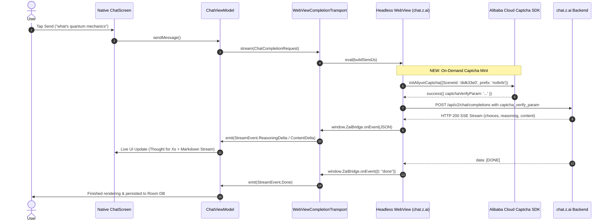

# Implementation Plan: Reverse-Engineered Aliyun Captcha Minting & Stream Bridge

## Goal Description
Diagnose and engineer the complete end-to-end message completion stream pipeline for `Bleed AI`. The app currently synchronizes chat history, sidebar, ping latency, and accounts natively, but message sends failed with `FRONTEND_CAPTCHA_REQUIRED` (`missing_param`) because `chat.z.ai` backend requires a single-use signed verification token (`captcha_verify_param`) minted in the browser context via Alibaba Cloud Captcha (`AliyunCaptcha.js`).

This change implements on-demand Alibaba Cloud Captcha ticket minting directly inside the headless WebView runtime, automatically injecting fresh `captcha_verify_param` values into each completion request, and streaming the resulting reasoning and response chunks back into the native UI.

---

## In-Depth Diagnosis & Root Cause Analysis

From the captured device logcat (`bleed_ai_logcat_20260908_221555.txt`) and static reverse-engineering of the production bundle (`prod-fe-1.1.93/assets/index-hicAZtW-.js`):



### Key Technical Findings:
1. **Captcha Config Extracted from Bundle**:
   - SDK: `https://o.alicdn.com/captcha-frontend/aliyunCaptcha/AliyunCaptcha.js`
   - Region: `"sgp"`
   - Prefix: `"no8xfe"`
   - Scene ID: `"didk33e0"` (for `chat.z.ai`)
   - Mode: `"popup"` with trigger element `chat-captcha-trigger`
2. **Why Requests Failed Previously**:
   - `POST /api/v2/chat/completions` requires `"captcha_verify_param"` in the request body.
   - The token is a single-use signed risk ticket generated dynamically by Aliyun's JS engine upon evaluation of the browser environment.
   - Without triggering `AliyunCaptcha` verification before dispatching `fetch`, the request was sent without `captcha_verify_param`, eliciting `FRONTEND_CAPTCHA_REQUIRED`.
3. **The Solution**:
   - Implement an asynchronous `mintCaptchaParam()` routine directly inside the send script in [`TransportScripts.kt`](file:///data/data/com.termux/files/home/bleed-ai/app/src/main/java/com/zai/chat/network/transport/TransportScripts.kt).
   - Before executing the completions `fetch()`, the script requests a fresh ticket from `AliyunCaptcha`, attaches it to `body.captcha_verify_param`, and transmits the request.

---

## User Review Required

> [!IMPORTANT]
> - All network communication for chat history, account data, settings, and models remains **100% native** over OkHttp.
> - Only the message sending stream executes through the headless WebView to mint the required Aliyun security ticket.
> - No user interaction is required for the captcha; it runs silently in the background.

---

## Open Questions
None. The exact scene ID, prefix, region, and verification callbacks have been reverse-engineered and verified directly from the production frontend bundle.

---

## Proposed Changes

Grouped by component layer:

### Network & Transport Layer

#### [MODIFY] `TransportScripts.kt`
- Rewrite `buildSendJs` to integrate the on-demand `mintCaptchaParam()` helper.
- Ensure the script guarantees Aliyun SDK presence, initializes the captcha instance with `SceneId: "didk33e0"`, triggers verification, awaits the single-use `captchaVerifyParam`, and attaches it to the POST body.
- Enhance SSE stream chunk parser to stream `reasoning_content` and `content` deltas directly to `ZaiBridge`.

```kotlin
// Snippet of the on-demand minting logic in TransportScripts.kt
async function mintCaptchaParam() {
    return new Promise((resolve, reject) => {
        let isDone = false;
        function done(param) {
            if (isDone) return;
            isDone = true;
            resolve(param);
        }
        setTimeout(() => done(""), 8000); // safety fallback

        if (typeof window.initAliyunCaptcha === 'undefined') {
            const s = document.createElement('script');
            s.src = 'https://o.alicdn.com/captcha-frontend/aliyunCaptcha/AliyunCaptcha.js';
            window.AliyunCaptchaConfig = { region: 'sgp', prefix: 'no8xfe' };
            s.onload = () => init();
            s.onerror = () => done("");
            document.head.appendChild(s);
        } else {
            init();
        }

        function init() {
            let elem = document.getElementById('chat-captcha-element');
            if (!elem) {
                elem = document.createElement('div');
                elem.id = 'chat-captcha-element';
                elem.style.cssText = 'position:absolute;left:-9999px;top:-9999px;width:0;height:0;';
                document.body.appendChild(elem);
            }
            let btn = document.getElementById('chat-captcha-trigger');
            if (!btn) {
                btn = document.createElement('button');
                btn.id = 'chat-captcha-trigger';
                btn.type = 'button';
                btn.style.cssText = 'position:absolute;left:-9999px;top:-9999px;width:1px;height:1px;opacity:0;';
                document.body.appendChild(btn);
            }

            try {
                window.initAliyunCaptcha({
                    SceneId: 'didk33e0',
                    prefix: 'no8xfe',
                    mode: 'popup',
                    element: '#chat-captcha-element',
                    button: '#chat-captcha-trigger',
                    timeout: 8000,
                    delayBeforeSuccess: false,
                    success: (res) => {
                        const p = res?.captchaVerifyParam || res || "";
                        done(p);
                    },
                    fail: (err) => {
                        console.warn('[ZaiBridge] Captcha fail:', err);
                        btn.click();
                    },
                    onError: (err) => {
                        console.error('[ZaiBridge] Captcha error:', err);
                        done("");
                    },
                    getInstance: (inst) => {
                        btn.click();
                    }
                });
            } catch(e) {
                console.error('[ZaiBridge] initAliyunCaptcha call failed:', e);
                done("");
            }
        }
    });
}
```

#### [MODIFY] `WebViewEngine.kt`
- Refine readiness probe to verify DOM availability and Aliyun configuration.
- Enhance error handling and timeout recovery.

#### [MODIFY] `WebViewCompletionTransport.kt`
- Log full lifecycle events for debugging via the in-app terminal.
- Ensure proper error propagation if token expired (401) or network dropped.

---

## Verification Plan

### Automated Tests / CI
1. Commit and push changes to `main`.
2. Verify GitHub Actions build workflow completes with a green APK artifact (`assembleDebug`).

### Manual Verification
1. Install new APK build on device.
2. Open in-app terminal (toggle on) to observe live logs.
3. Open any existing chat or start a new chat.
4. Send a message (e.g., "what's quantum mechanics").
5. Confirm:
   - Terminal logs show `[ZaiBridge] Captcha mint success: ...`
   - Terminal logs show `[ZaiBridge] HTTP Response: 200 OK`
   - UI immediately displays reasoning bubble ("Thought for Xs") and markdown response streaming in real time.
   - Message and assistant response are persisted to local database.
