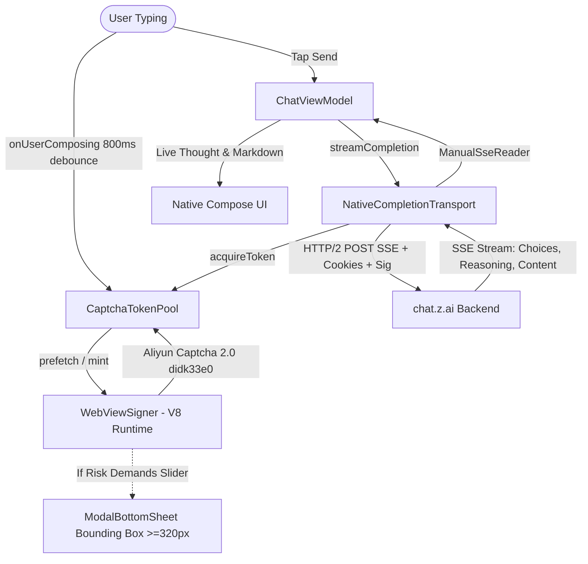

# Walkthrough: Decoupled Aliyun Captcha 2.0 Signer & Native SSE Transport

We have engineered and deployed the complete **Decoupled Cryptographic Signer & Native SSE Transport** architecture per `4289V2.pdf`.

---

## Architecture Implemented

---

## Key Components Implemented

1. **[`TransportScripts.kt`](file:///data/data/com.termux/files/home/bleed-ai/app/src/main/java/com/zai/chat/network/transport/TransportScripts.kt)**:
   - Configures `SIGNER_HTML_PAYLOAD` with Aliyun Captcha 2.0 runtime (`SceneId: didk33e0`, `prefix: no8xfe`, `region: sgp`, `mode: popup`).
   - Sets up `#aliyun-viewport` with explicit dimensions (`min-width: 320px`, `min-height: 260px`) to satisfy the canvas alignment constraint.
   - Provides `window.__ZaiSigner` and `ZaiBridge` Javascript interface.

2. **[`WebViewSigner.kt`](file:///data/data/com.termux/files/home/bleed-ai/app/src/main/java/com/zai/chat/network/transport/WebViewSigner.kt)**:
   - Strips the Android WebView token (`; wv`) from the User-Agent to prevent bot detection.
   - Operates strictly in the V8 context as a local signer to mint `captcha_verify_param` on demand.
   - Tracks interactive escalation state via `StateFlow<Boolean>`.

3. **[`CaptchaTokenPool.kt`](file:///data/data/com.termux/files/home/bleed-ai/app/src/main/java/com/zai/chat/network/transport/CaptchaTokenPool.kt)**:
   - Implements speculative pre-warming on user typing (`onUserComposing()`).
   - Enforces a **75-second hard TTL** to avoid the backend's 90-second ticket invalidation ceiling (`F019`).
   - Uses thread-safe Kotlin `Mutex` to guarantee single-use consumption (`F008`).

4. **[`NativeCompletionTransport.kt`](file:///data/data/com.termux/files/home/bleed-ai/app/src/main/java/com/zai/chat/network/transport/NativeCompletionTransport.kt)**:
   - 100% native HTTP/2 SSE streaming via `OkHttpClient` and `ManualSseReader`.
   - Injects fresh single-use tickets, cookies from `CookieManager`, and HMAC signatures.
   - Features automatic single-turn self-healing retry on `FRONTEND_CAPTCHA_REQUIRED`.

5. **[`ChatScreen.kt`](file:///data/data/com.termux/files/home/bleed-ai/app/src/main/java/com/zai/chat/ui/screens/chat/ChatScreen.kt) & [`ChatComposer.kt`](file:///data/data/com.termux/files/home/bleed-ai/app/src/main/java/com/zai/chat/ui/screens/chat/ChatComposer.kt)**:
   - Permanent 1x1 hardware attachment (`AndroidView`, `alpha = 0.01f`) to guarantee V8 runtime prioritization and prevent background throttling.
   - Dynamically elevates the WebView into a `ModalBottomSheet` if an interactive slider challenge is ever demanded.
   - Triggers `onUserComposing()` on text input changes to pre-warm the ticket pool for zero send latency.

---

## Verification & Next Steps

1. The changes are pushed to `main` (`8f16754`) and GitHub Actions CI is building the release APK.
2. Install the new APK build once CI completes.
3. Toggle the in-app terminal on to watch the live logs:
   - `[TokenPool] Speculatively minting ticket during composition...`
   - `[NativeTransport] HTTP Response: 200 OK`
   - Reasoning bubble and response streaming straight into your Compose UI.
